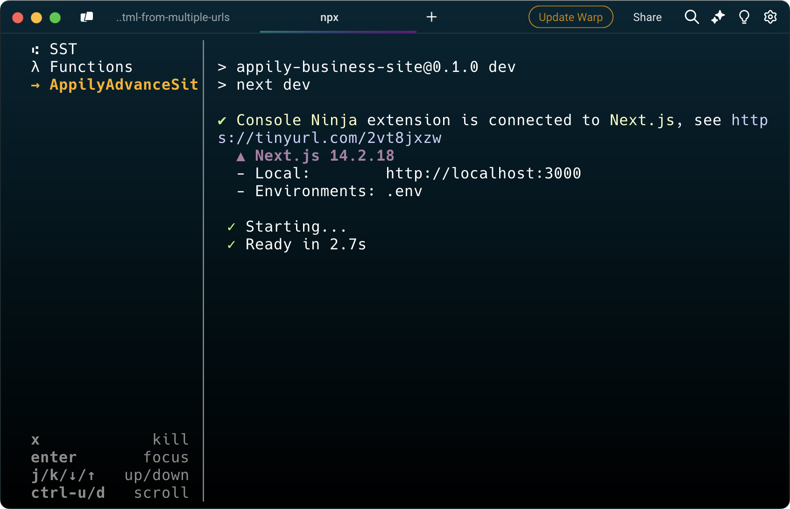

# Getting Started (with Bun)

Edit

## Payload

First you'll need an instance of our [Payload CMS](https://github.com/eab-agency/appily-cms) if you want to connect locally. Take note of your server URL, you'll need this in the next step.

### Next.js App Setup

Get your environment setup:

1. First copy the example `.env` file as your own:

   ```bash
     cp .env.example .env
   ```

2. Then open the `.env` file and put in appropriate values:

   ```bash
     NEXT_PUBLIC_APP_URL=http://localhost:3000
     NEXT_PUBLIC_CMS_URL=http://point-to-your-cms-here
     SECRET_COOKIE_PASSWORD=make-it-a-random-string
   ```

### Local Dev Environment Setup

Configure your aws credentials:

1. Install the AWS CLI: [https://docs.aws.amazon.com/cli/latest/userguide/install-cliv2.html](https://docs.aws.amazon.com/cli/latest/userguide/install-cliv2.html)
2. Run `aws configure` in your terminal
3. Enter your AWS Access Key ID and Secret Access Key
4. Enter your default region (us-east-1)
5. Enter your default output format (json)

Your ~/.aws/credentials file should look like this:

```bash
[default]
   aws_access_key_id = XXXXXXXXXXXXXXXXX
   aws_secret_access_key = XXXXxxXXxxXXXXXxxxXXXxX
```

Your ~/.aws/config file should look like this:

```bash
[default]
   region = us-east-1
```

First, run the development server with sst:

```bash
npx sst dev
```

This starts a multiplexer with processes that deploy your app, run your functions, and start your frontend.


